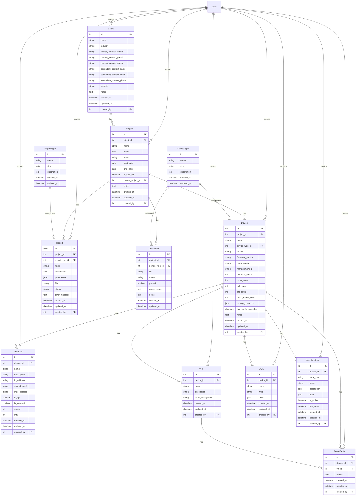

# VAR AI Database Schema

This document contains the database schema for the VAR AI project in Mermaid format.

## Schema Description

The database schema represents a network device inventory and reporting system with the following key components:

1. **Client Management**
   - Clients can have multiple projects
   - Each client has contact information and metadata

2. **Project Management**
   - Projects belong to clients
   - Projects can have parent-child relationships
   - Projects contain devices and reports

3. **Device Management**
   - Devices belong to projects
   - Devices have multiple components (interfaces, VRFs, ACLs, etc.)
   - Devices are categorized by device types

4. **Configuration Management**
   - Device configurations are stored as files
   - Configurations are parsed and stored in structured format
   - Inventory items track device components

5. **Reporting System**
   - Reports are generated for projects
   - Reports are categorized by report types
   - Reports track their generation status and parameters

6. **User Integration**
   - All major entities track their creator
   - Audit fields (created_at, updated_at) are present on all models

## Key Relationships

- A Client can have multiple Projects
- A Project can have multiple Devices and Reports
- A Device can have multiple Interfaces, VRFs, ACLs, and Inventory Items
- A VRF can have multiple Route Tables
- All entities are linked to Users for tracking creation
- Device Types categorize both Devices and Device Files
- Report Types categorize Reports 